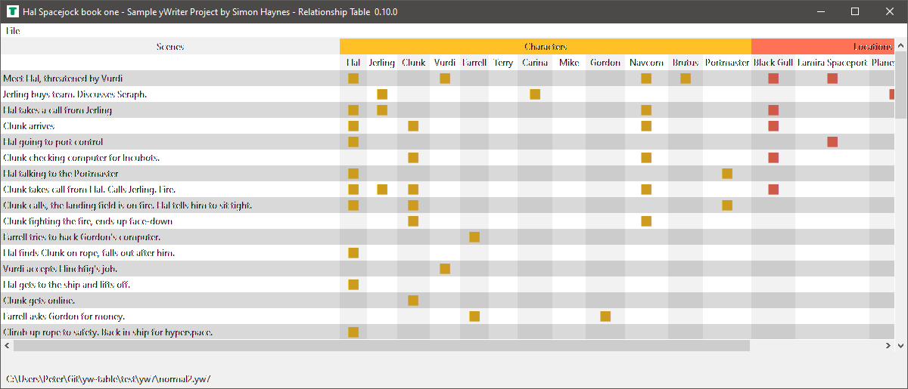

# yw-table

*yw-table* provides a scene relationship table for yWriter projects. 

## Features

- Display scene relationships to characters, locations, items, and arcs with a table.
- Add/Remove relationships by klicking on the cells.
- Export the table as csv.

## Requirements

- [Python](https://www.python.org/) version 3.6+.
- [yWriter 7](http://spacejock.com/yWriter7.html). Recent versions 5 or 6 might also work if they save in .yw7 file format.

## Download and install

[Download the latest release (version 1.0.3)](https://github.com/peter88213/yw-table/raw/main/dist/yw_table_v1.0.3.zip)

- Unzip the downloaded zipfile "yw_table_v1.0.3.zip" into a new folder.
- Move into this new folder and launch **setup.pyw**. This installs the program for the local user.
- Open "README.md" for usage instructions.

### Note for Linux users

Please make sure that your Python3 installation has the *tkinter* module. On Ubuntu, for example, it is not available out of the box and must be installed via a separate package. 

------------------------------------------------------------------

[Changelog](changelog)

## Usage

See the [instructions for use](usage)

## Credits

- The icons are made using the free *Pusab* font by Ryoichi Tsunekawa, [Flat-it](http://flat-it.com/).

## License

This is Open Source software, and *yw-table* is licensed under GPLv3. See the
[GNU General Public License website](https://www.gnu.org/licenses/gpl-3.0.en.html) for more
details, or consult the [LICENSE](https://github.com/peter88213/yw-table/blob/main/LICENSE) file.
